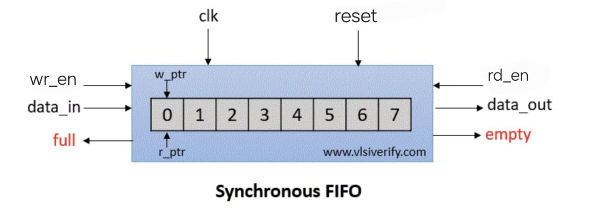
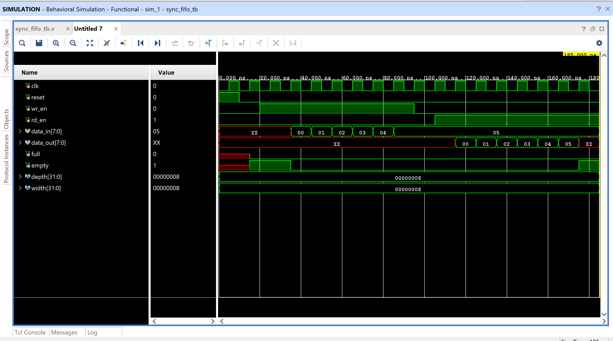

# Synchronous FIFO (First-In-First-Out) Memory Buffer

This project implements a **parameterized synchronous FIFO** (First-In-First-Out) buffer using **Verilog HDL**. FIFO is a critical component in digital systems for temporary data storage, especially useful in **pipelining, buffering, and interfacing between blocks with different clock domains**.

---

##  Features
- **Parameterizable** FIFO depth and data width
- **Synchronous read and write operations**
- Automatic management of **full** and **empty** flags
- Easy to simulate and test with Vivado

---

## Variables Table
| Variable     | Type              | Description                                    |
|--------------|-------------------|------------------------------------------------|
| `data_in`    | Input [width-1:0] | Data to be written into FIFO                   |
| `clk`        | Input             | System clock                                   |
| `wr_en`      | Input             | Write enable signal                            |
| `rd_en`      | Input             | Read enable signal                             |
| `reset`      | Input             | Synchronous reset                              |
| `data_out`   | Output [width-1:0]| Data read from FIFO                            |
| `full`       | Output            | Flag indicating FIFO is full                   |
| `empty`      | Output            | Flag indicating FIFO is empty                  |
| `wr_ptr`     | Internal          | Write pointer                                  |
| `rd_ptr`     | Internal          | Read pointer                                   |
| `count`      | Internal          | Number of elements currently in FIFO           |

---

##  FIFO Diagram

- `wr_en`, `data_in`: Write interface
- `rd_en`, `data_out`: Read interface
- `clk`, `reset`: Clock & active-high reset
- `full`, `empty`: Status indicators

---
##  Parameters
| Parameter | Description               | Default |
|-----------|---------------------------|---------|
| `depth`   | Number of FIFO registers  | 8       |
| `width`   | Bit-width of each element | 8       |

---

##  Internal Architecture
- **Write pointer (wr_ptr)** and **Read pointer (rd_ptr)** control data movement
- **Count register** keeps track of how many entries are stored
- **`full`** is high when FIFO is completely filled
- **`empty`** is high when FIFO has no data

---

### Waveform Analysis

- The waveform shows **`data_in` from 00 to 05 being written** while `wr_en` is high.
- `data_out` starts producing valid values after read enable (`rd_en`) is asserted:
  - It **outputs values from 00 to 05**, maintaining correct FIFO behavior (First-In-First-Out).
- `full` remains low throughout because only 6/8 slots are used.
- `empty` is `1` at the start (FIFO empty) and becomes `0` after data is written.
- At the end of read phase, `empty` becomes `1` again, indicating **FIFO is empty**.

 This confirms:
- Proper `write` and `read` pointer increment.
- Accurate assertion of `full` and `empty` flags.
- Sequential, reliable data storage and retrieval in FIFO order.

---
  
##  Tools Used
- Xilinx Vivado (for writing code, simulation, and waveform analysis)

