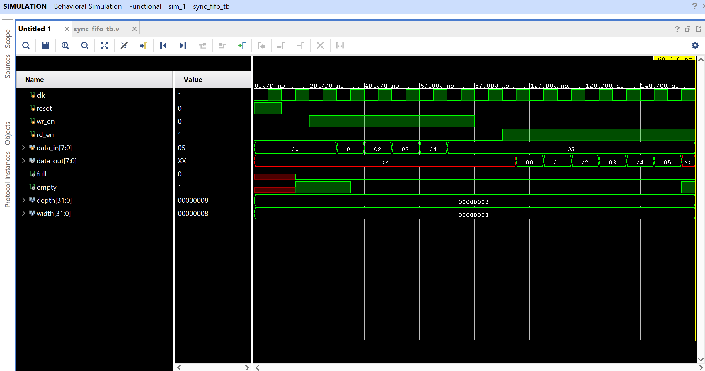

# 🔁 Synchronous FIFO (First-In-First-Out) Memory Buffer

This project implements a **parameterized synchronous FIFO** (First-In-First-Out) buffer using **Verilog HDL**. FIFO is a critical component in digital systems for temporary data storage, especially useful in **pipelining, buffering, and interfacing between blocks with different clock domains**.

---

## 📌 Features
- **Parameterizable** FIFO depth and data width
- **Synchronous read and write operations**
- Automatic management of **full** and **empty** flags
- Easy to simulate and test with Vivado

---

## 📁 Files Included
| File Name        | Description                                |
|------------------|--------------------------------------------|
| `sync_fifo.v`     | Main FIFO module                          |
| `sync_fifo_tb.v`  | Testbench for simulation                  |
| `waveform.png`    | Simulation waveform output                |
| `README.md`       | Project documentation                     |

---

## 📐 FIFO Block Diagram


---

## 🔧 Parameters
| Parameter | Description               | Default |
|-----------|---------------------------|---------|
| `depth`   | Number of FIFO registers  | 8       |
| `width`   | Bit-width of each element | 8       |

---

## 🧠 Internal Architecture
- **Write pointer (wr_ptr)** and **Read pointer (rd_ptr)** control data movement
- **Count register** keeps track of how many entries are stored
- **`full`** is high when FIFO is completely filled
- **`empty`** is high when FIFO has no data


---

## 🧪 Testbench Strategy
- Write 6 values to FIFO
- Then read all values one by one
- Observe `full`, `empty`, and `data_out`

---

## 📷 Waveform & Testbench Explanation

### ✅ Testbench Functionality

The testbench (`sync_fifo_tb.v`) is written to **verify the correct operation** of the synchronous FIFO module through **controlled input stimuli and observations of output responses**.

#### 🔁 Clock Generation
```verilog
initial begin
  clk = 0;
  forever #5 clk = ~clk;
end
```
- A **10ns period clock** (100 MHz frequency) is generated using a `forever` loop with a toggle every 5ns.

#### 🔄 Reset Phase
```verilog
reset = 1;
#10;
reset = 0;
```
- FIFO is **synchronously reset** for the first 10ns to clear all internal registers like `wr_ptr`, `rd_ptr`, `count`, and flags (`full`, `empty`).

#### ✍ Write Operation
```verilog
wr_en = 1;
data_in = 8'd0; #10;
...
data_in = 8'd5; #10;
```
- 6 data values (`00` to `05`) are **written sequentially** into the FIFO buffer.
- `wr_en` is asserted for 6 clock cycles, and `data_in` is updated at every cycle.

#### 📤 Read Operation
```verilog
wr_en = 0;
#10;
rd_en = 1;
#70;
```
- After writing, there's a **gap cycle** (realistic timing consideration) before reading begins.
- `rd_en` is enabled, and FIFO **reads out all 6 stored values** one by one at each positive clock edge.

---

### 📈 Waveform Analysis



- The waveform shows **`data_in` from 00 to 05 being written** while `wr_en` is high.
- `data_out` starts producing valid values after read enable (`rd_en`) is asserted:
  - It **outputs values from 00 to 05**, maintaining correct FIFO behavior (First-In-First-Out).
- `full` remains low throughout because only 6/8 slots are used.
- `empty` is `1` at the start (FIFO empty) and becomes `0` after data is written.
- At the end of read phase, `empty` becomes `1` again, indicating **FIFO is drained**.

✅ This confirms:
- Proper `write` and `read` pointer increment.
- Accurate assertion of `full` and `empty` flags.
- Sequential, reliable data storage and retrieval in FIFO order.

---
  
## 🛠 Tools Used
- Xilinx Vivado (for writing code, simulation, and waveform analysis)

